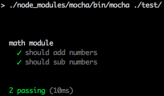

# Mocha

## 安裝

```sh
npm install --save-dev mocha chai
```

## 設定測試目錄

在 `package.json` 設定測試檔案是在哪個目錄，這樣的話我們就可以直接執行 `npm test` 去執行我們的測試了

```json
"scripts": {
    "test": "./node_modules/mocha/bin/mocha path/to/test"
},
```

像是我將測試的檔案放在專案下的 `test` 目錄下，我就可以將此行設定設為，這樣的話我們就可以使用 `npm test` 執行 `test` 目錄下的所有測試了

```json
"scripts": {
    "test": "./node_modules/mocha/bin/mocha ./test/"
},
```

## 第一個測試程式

在 test 目錄下建立我們的第一個測試程式 `mathTest.js`

```js
describe('math module', function(){
    it('should add numbers', function () {
        assert.equal((1+1), '2');
        assert.strictEqual(127 + 319, 446);
    });

    it('should sub numbers', function () {
        assert.equal((22-1), '21');
        assert.strictEqual(127 - 7, 120);
    });
});
```

開始測試第一個 Node.js 程式

```sh
$ npm test
```



## 參考資料
* [Introduction to Testing Node.js](https://www.youtube.com/watch?v=u2XCdkL4bWI)
* [Node Unit Test Examples](https://github.com/jakerella/node-unit-tests)
* [mocha](https://mochajs.org/)
* [chai](http://chaijs.com/)