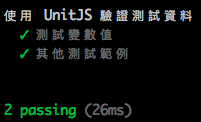

# UnitJS

我們常常需要用不同的 assert 方式去驗證我們測試的資料，除了 Mocha 內建的驗證工具外，我們可以使用 [UnitJS](http://unitjs.com/) 去結合不同的驗證資料方式

## 安裝

```sh
npm install unit.js --save-dev
```

## 使用 UnitJS 去做資料驗證

我們使用官方網站的[測試範例](http://unitjs.com/guide/quickstart.html)去做簡單的變數值測試，我們將此測試檔案放在專案的 `/test/firstUnitJSTest.js` 目錄下

```js
var test = require('unit.js');

describe('使用 UnitJS 驗證測試資料', function() {
    it('測試變數值', function() {
        // 簡單測試變數值
        var example = 'hello world';
        test
            .string(example)
            .startsWith('hello')
            .match(/[a-z]/)
            .given(example = 'you are welcome')
            .string(example)
            .endsWith('welcome')
            .contains('you')
            .when('"example" becomes an object', function() {
                example = {
                    message: 'hello world',
                    name: 'Nico',
                    job: 'developper',
                    from: 'France'
                };
            })
            .then('test the "example" object', function() {
                test
                    .object(example)
                    .hasValue('developper')
                    .hasProperty('name')
                    .hasProperty('from', 'France')
                    .contains({
                        message: 'hello world'
                    });
            })
            .if(example = 'bad value')
            .error(function() {
                example.badMethod();
            });
    });


    it('其他測試範例', function() {
        // ...
    });
});
```

## 開始測試

使用安裝在本地端的 mocha 去進行單元測試

```sh
./node_modules/mocha/bin/mocha ./test/firstUnitJSTest.js
```



## 其他資料驗證方法

### Nodejs Assert

```js
// 測試 'string' type
test.assert(typeof 'foobar' == 'string');

// 資料相等驗證（ '==' ）
test.assert.equal('foobar', 'foobar');

// 完整資料及格式相等驗證（ '===' ）
test.assert.strictEqual('foobar', 'foobar');

// 取出驗證方法
var assert = test.assert;
assert(typeof 'foobar' == 'string');
assert.equal('foobar', 'foobar');
assert.strictEqual('foobar', 'foobar');
```

### Must.js

```js
var test = require('unit.js');

// 測試 'string' 類型
test.must('foobar').be.a.string();

// 資料相等驗證（ '==' ）
test.must('foobar' == 'foobar').be.true();

// 完整資料及格式相等驗證（ '===' ）
test.must('foobar').be.equal('foobar');

// 其他驗證方式
// 測試 'string' 類型
('foobar').must.be.a.string();

// 資料相等驗證（ '==' ）
('foobar' == 'foobar').must.be.true();

// 完整資料及格式相等驗證（ '===' ）
('foobar').must.be.equal('foobar');


// 取出驗證方法
var must = test.must;

// 測試 'string' 類型
must('foobar').be.a.string();

// 資料相等驗證（ '==' ）
must('foobar' == 'foobar').be.true();

// 完整資料及格式相等驗證（ '===' ）
must('foobar').be.equal('foobar');

```


### Should.js

```js
var test = require('unit.js');

// 測試 'string' 類型
test.should('foobar').be.type('string');

// 資料相等驗證（ '==' ）
test.should('foobar' == 'foobar').be.ok;

// 完整資料及格式相等驗證（ '===' ）
test.should('foobar').be.equal('foobar');


// 其他驗證方式
// 測試 'string' 類型
('foobar').should.be.type('string');

// 資料相等驗證（ '==' ）
('foobar' == 'foobar').should.be.ok;

// 完整資料及格式相等驗證（ '===' ）
('foobar').should.be.equal('foobar');


// 取出驗證方法
var should = test.should;

// 測試 'string' 類型
should('foobar').be.type('string');

// 資料相等驗證（ '==' ）
should('foobar' == 'foobar').be.ok;

// 完整資料及格式相等驗證（ '===' ）
should('foobar').be.equal('foobar');

```


## 參考資料
* [unitjs](http://unitjs.com/)
* [Assert module of Node.js - Unit JS](http://unitjs.com/guide/assert-node-js.html)
* [Must.js API Documentation - Unit JS](http://unitjs.com/guide/must-js.html)
* [Should.js API documentation - Unit JS](http://unitjs.com/guide/should-js.html)